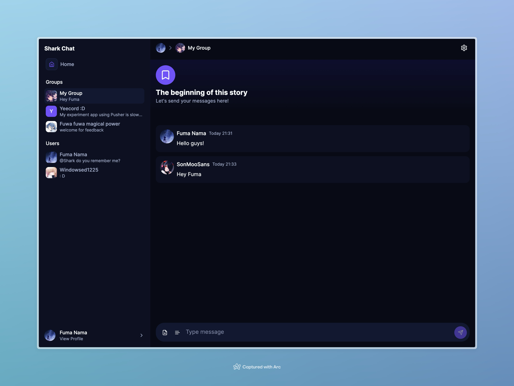

# Shark Chat

A Chat app built with Trpc, Tailwind CSS, Ably, Redis, Cloudinary, Drizzle ORM, Next.js.

This repository is a monorepo ([Turborepo](https://turbo.build)).



## Features

- Create, Update, Delete Chat Group
- Send, Update, Delete Message
- Markdown (gfm, tables supported) in Messages
- Reference Messages
- Message Embeds (Display open-graph data of links in message)
- Send Images/Files via Message
- Direct Message with anyone
- View & Kick Group members
- Invite Group members via Invite code or Url
- Upload user avatar, group banner and icon images
- Show notification when new Message received
- AI-Powered Message Writer
- Built-in AI Chatbot (Powered by Inworld)
- Delete Accounts
- Light & Dark Mode
- 100% Typescript

**Play with it:** https://shark-chat.vercel.app
<br />
**Learn More:** https://shark-chat.vercel.app/info

## Play with it Locally

Shark Chat integrated with many third-party service for supporting wide spectrum of features and work perfectly on serverless environment.

Thus, you have to register an account for each services in order to setup the project correctly before playing with it locally.
Please fill all environment variables in the [.env.example](/.env.example).

### Upstash

Create a Redis database at their [website](https://upstash.com) and get `REDIS_URL`, `REDIS_TOKEN` from the console.

### Ably Realtime

Create a new project on https://ably.com, paste `ABLY_API_KEY` into environment varibles.

### Database

By default, it uses Drizzle ORM with Neon Serverless Postresql for database. You may use other providers if you prefer.

Create a Postresql database and get your `DATABASE_URL` and `DATABASE_PUSH_URL`.

> Note
>
> `DATABASE_PUSH_URL` is used for pushing changes which has pool connections disabled.

### Cloudinary

Create a new project on https://cloudinary.com, copy the cloud name, key and API secret.

### Next Auth

Fill `NEXTAUTH_URL` and `NEXTAUTH_SECRET`, read their [docs](https://next-auth.js.org/getting-started/example) for further details.

Currently, only Github OAuth is supported. Follow [this guide](https://docs.github.com/en/apps/oauth-apps/building-oauth-apps/authorizing-oauth-apps) to setup the OAuth App on Github, generate a `GITHUB_ID` with `GITHUB_SECRET`.

### Development Mode

Run `pnpm run dev` and edit files to see changes.

### Build from Source

This project uses Turborepo and PNPM.

```bash
pnpm run build
```

It should be able to deploy on Vercel or any other platforms.
